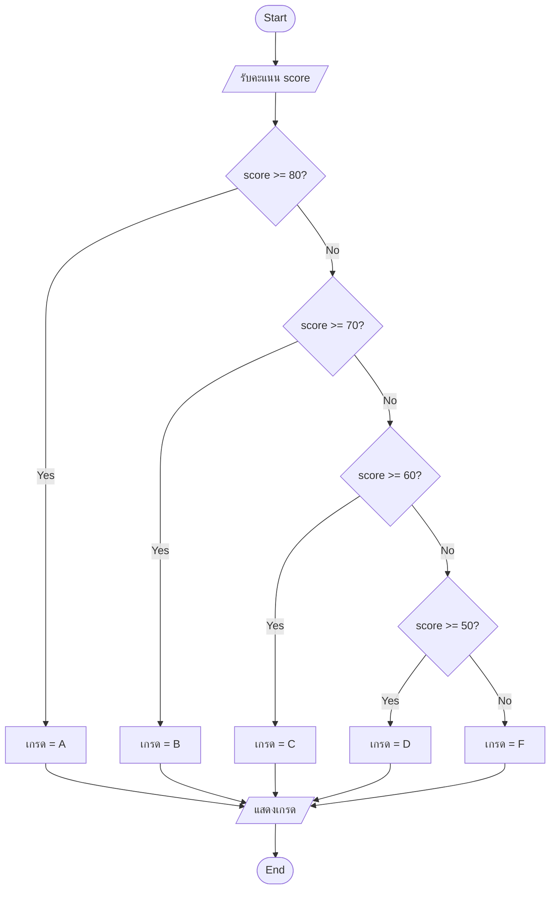
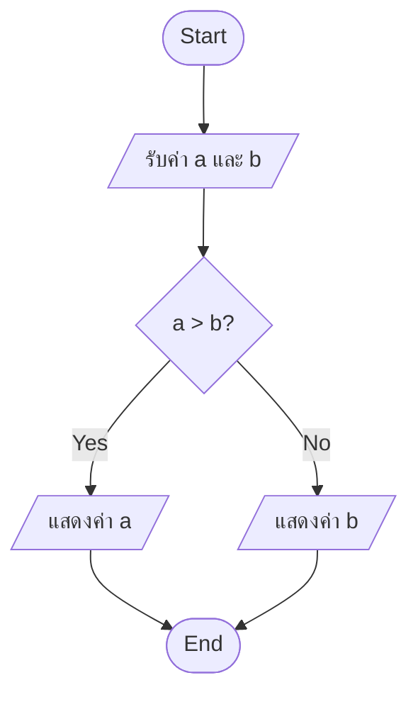
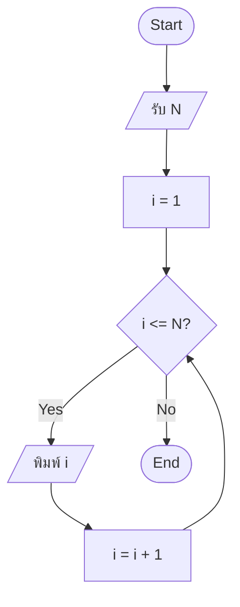

```mermaid
flowchart TD
Start([Start]) --> Input[/รับคะแนน score/]
Input --> D1{score >= 80?}
D1 -->|Yes| A[เกรด = A]
D1 -->|No| D2{score >= 70?}
D2 -->|Yes| B[เกรด = B]
D2 -->|No| D3{score >= 60?}
D3 -->|Yes| C[เกรด = C]
D3 -->|No| D4{score >= 50?}
D4 -->|Yes| D[เกรด = D]
D4 -->|No| F[เกรด = F]
A & B & C & D & F --> Output[/แสดงเกรด/]
Output --> End([End])
```

```mermaid
flowchart TD
	start([Start]) --> Input[/รับค่า a และ b/]
	Input --> Q1{a > b?}
	Q1 --> |Yes| A[/แสดงค่า a/]
	Q1 --> |No| B[/แสดงค่า b/]
	A & B --> End([End])
```

```mermaid
flowchart TD
	Start([Start]) --> Input[/รับ N/]
	Input --> P1[i = 1 ]
	P1 --> Q1{i <= N?}
	Q1 --> |Yes|A[/พิมพ์ i/]
	A --> P2[i = i + 1]
	P2 --> Q1
	Q1 --> |No|End([End])
```
