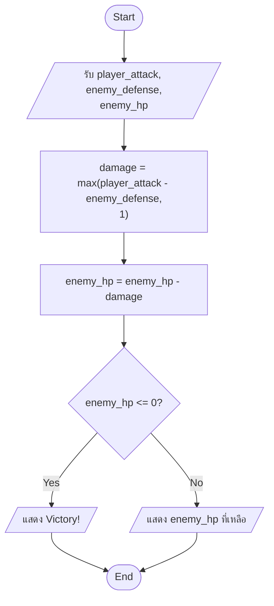
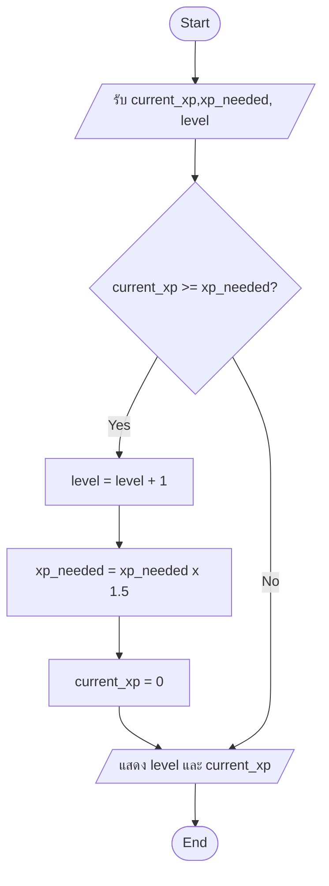
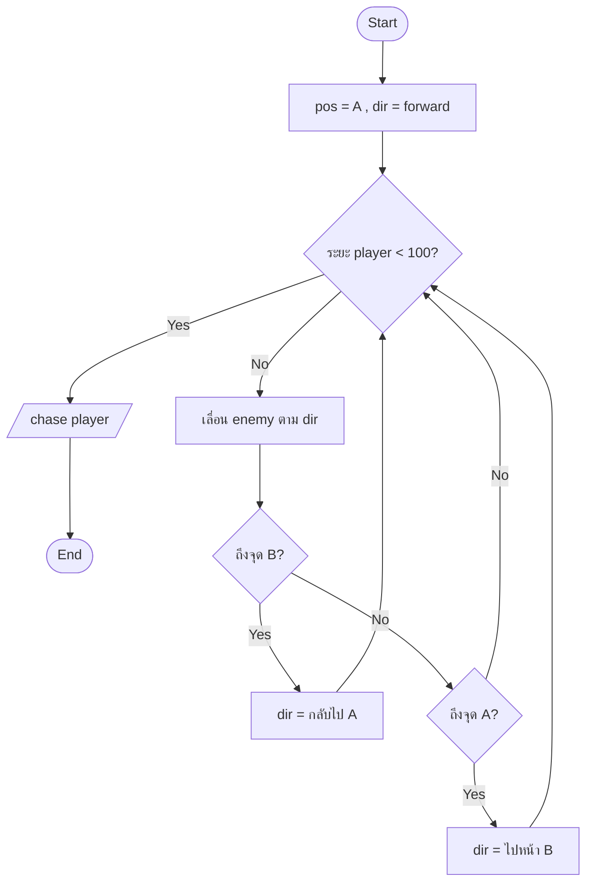

```mermaid
flowchart TD
Start([Start]) --> Input[/รับ player_attack, enemy_defense,
enemy_hp/]
Input --> Calc["damage = max(player_attack - enemy_defense,
1)"]
Calc --> Reduce["enemy_hp = enemy_hp - damage"]
Reduce --> D1{enemy_hp <= 0?}
D1 -->|Yes| Win[/แสดง Victory!/]
D1 -->|No| Show[/แสดง enemy_hp ที่เหลือ/]
Win & Show --> End([End])
```

```mermaid
flowchart TD
	Start([Start]) --> I1[/รับ current_xp,xp_needed, level/]
	I1 --> Q1{current_xp >= xp_needed?}
	Q1 --> |Yes|A[level = level + 1]
	A --> B[xp_needed = xp_needed x 1.5]
	B --> C[current_xp = 0 ]
	C --> O1[/แสดง level และ current_xp/]
	Q1 --> |No|O1
	O1 --> End([End])
```

```mermaid
flowchart TD
	Start([Start]) --> P1[pos = A , dir = forward]
	P1 --> Q1{ระยะ player < 100?}
	Q1 --> |Yes|A[/chase player/]
	A --> End([End])
	Q1 --> |No|B[เลื่อน enemy ตาม dir]
	B --> Q2{ถึงจุด B?} 
	Q2 --> |Yes|C[dir = กลับไป A]
	C --> Q1
	Q2 --> |No|Q3{ถึงจุด A?}
	Q3 --> |No|Q1
	Q3 --> |Yes|D[dir = ไปหน้า B]
	D --> Q1
```
